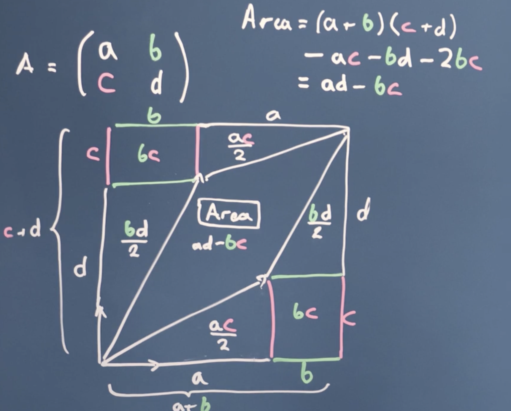

## Motivations
1. Simultaneous equations
2. Optimization Problem in Regression


# Vectors
### What is a vector?

假設有兩個向量：
  1. 要投影的向量: $\vec{a}$ 
  2. 投影的方向: $\vec{b}$
  - 向量投影的意思是：找出一個跟 $\vec{b}$ 方向相同的向量，長度等於 $\vec{a}$ 在 $\vec{b}$ 上的影子。

1. #### *A list of numbers*
    - Vectors are usually viewed by computers as an ordered list of numbers which they can perform "operations" on - some operations are very natural and, as we will see, very useful!

2. #### *Position in three dimensions of space and in one dimension of time*
    - A vector in space-time can be described using 3 dimensions of space and 1 dimension of time according to some co-ordinate system.

3. #### *Something which moves in a space of fitting parameters*
    - Vectors can be viewed as a list of numbers which describes some optimisation problem.
4. #### *Commutative of Vectors*
    - Example: Let’s consider two vectors:

      $\vec{a} = \begin{bmatrix} 2 \\ 3 \end{bmatrix}, \quad \vec{b} = \begin{bmatrix} 4 \\ 1 \end{bmatrix}$  
      - `Vector Addition:`
        $\vec{a} + \vec{b} = \begin{bmatrix} 2 \\ 3 \end{bmatrix} + \begin{bmatrix} 4 \\ 1 \end{bmatrix} = \begin{bmatrix} 2+4 \\ 3+1 \end{bmatrix} = \begin{bmatrix} 6 \\ 4 \end{bmatrix}$
      - `Vector Subtraction:`
        $\vec{a} - \vec{b} = \begin{bmatrix} 2 \\ 3 \end{bmatrix} - \begin{bmatrix} 4 \\ 1 \end{bmatrix} = \begin{bmatrix} 2-4 \\ 3-1 \end{bmatrix} = \begin{bmatrix} -2 \\ 2 \end{bmatrix}$
      - `Scalar Multiplication:`
        $3\vec{a} = 3 \begin{bmatrix} 2 \\ 3 \end{bmatrix} = \begin{bmatrix} 3 \times 2 \\ 3 \times 3 \end{bmatrix} = \begin{bmatrix} 6 \\ 9 \end{bmatrix}$
      - `Dot Product (Scalar Product):`
        $\vec{a} \cdot \vec{b} = (2)(4) + (3)(1) = 8 + 3 = 11$
      - `Magnitude (Length) of a Vector:`

        $|\vec{a}| = \sqrt{2^2 + 3^2} = \sqrt{4 + 9} = \sqrt{13}$
        
        $|\vec{b}| = \sqrt{4^2 + 1^2} = \sqrt{16 + 1} = \sqrt{17}$
      - `Unit Vector:`
        $\hat{a} = \frac{\vec{a}}{|\vec{a}|} = \frac{1}{\sqrt{13}} \begin{bmatrix} 2 \\ 3 \end{bmatrix} = \begin{bmatrix} 2/\sqrt{13} \\ 3/\sqrt{13} \end{bmatrix}$
      - `Commutativity of Vector Addition:`

        $\vec{a} + \vec{b} = \begin{bmatrix} 2 \\ 3 \end{bmatrix} + \begin{bmatrix} 4 \\ 1 \end{bmatrix} = \begin{bmatrix} 2+4 \\ 3+1 \end{bmatrix} = \begin{bmatrix} 6 \\ 4 \end{bmatrix}$

      ✅ The result is the same regardless of the order:
      > $\vec{a} + \vec{b} = \vec{b} + \vec{a}$

5. #### *Vectors are "orthogonal" or "perpendicular"* 
    ### $\vec{a} \cdot \vec{b}=0$

---
### *Projection of a Vector Using Cosine* 
  1. #### *The `scalar projection` of $\vec{a}$ onto $\vec{b}$ is: $|\vec{a}| \cos \theta$*

      since $\vec{a} \cdot \vec{b} = |\vec{a}| |\vec{b}| \cos \theta$ , $\frac{\vec{a} \cdot \vec{b}}{|\vec{b}|} = |\vec{a}| \cos \theta$
      - How much of $\vec{a}$ is in the direction of $\vec{b}$ (length only). This represents the **length of the shadow** of $\vec{a}$ onto the direction of $\vec{b}$.

  2. #### *The `vector projection` further scales this shadow in the direction of $\vec{b}$.* 
    
      (The actual vector pointing in the same direction as $\vec{b}$)

      since $\vec{a} \cdot \vec{b} = |\vec{a}| |\vec{b}| \cos \theta => \frac{\vec{a} \cdot \vec{b}}{|\vec{b}|} = |\vec{a}| \cos \theta$
      - $\frac{\vec{a} \cdot \vec{b}}{|\vec{b}|} \times \frac{\vec{b}}{|\vec{b}| } = \frac{\vec{a} \cdot \vec{b}}{|\vec{b}|^2} \vec{b} = \vec{a} \cos \theta \cdot \frac{\vec{b}}{|\vec{b}|}$

      - The projection of $\vec{a}$ onto $\vec{b}$ can be calculated using the following formula:

        ### $\text{proj}_{\vec{b}} \vec{a} = \frac{\vec{a} \cdot \vec{b}}{|\vec{b}|^2} \vec{b}$

      - Using the cosine of the angle between the two vectors, the formula can also be expressed as:
  
        ### $\text{proj}_{\vec{b}} \vec{a} = \frac{|\vec{a}| \cdot |\vec{b}| \cdot \cos \theta}{|\vec{b}|^2} \vec{b} = \frac{|\vec{a}| \cos \theta}{|\vec{b}|} \vec{b}$

        ### = (scaler projection of $\vec{a}$ onto $\vec{b}$) $\cdot \frac{\vec{b}}{|\vec{b}}$ 

        Where $\vec{a} \cdot \vec{b}$ is the dot product, $|\vec{a}|$ and $|\vec{b}|$ are the magnitudes, and $\theta$ is the angle between $\vec{a}$ and $\vec{b}$.
        
---
### *Changing basis*
- Example
  - $\vec{V} = \begin{bmatrix} 4 \\ 2 \end{bmatrix}$
    Suppose we want to express **v** in a new basis: 
    
    $\vec{b}_1 = \begin{bmatrix} 1 \\ 1 \end{bmatrix}, \quad \vec{b}_2 = \begin{bmatrix} 1 \\ -1 \end{bmatrix}$ Find $\vec{V_b}$ ?
  1. #### Find the vector projection of $\vec{V}$ onto $\vec{b}_1$:
    
      $\text{proj}_{\vec{b_1}} \vec{V} = \frac{\vec{V} \cdot \vec{b_1}}{|\vec{b_1}|^2} \vec{b_1}$
        $\vec{V} \cdot \vec{b_1} = (4)(1) + (2)(1) = 6$

      $|\vec{b_1}|^2 = 1^2 + 1^2 = 2$
      
      $\text{proj}_{\vec{b_1}} \vec{V} = \frac{6}{2} \vec{b_1} = 3 \vec{b_1} = \begin{bmatrix} 3 \\ 3 \end{bmatrix}$

  2. #### Find the vector projection of $\vec{V}$ onto $\vec{b}_2$:
      $\text{proj}_{\vec{b_2}} \vec{V} = \frac{\vec{V} \cdot \vec{b_2}}{|\vec{b_2}|^2} \vec{b_2}$
      
      $\vec{V} \cdot \vec{b_2} = (4)(1) + (2)(-1) = 2$
      
      $|\vec{b_2}|^2 = 1^2 + (-1)^2 = 2$
      
      $\text{proj}_{\vec{b_2}} \vec{V} = \frac{2}{2} \vec{b_2} = 1 \vec{b_2} = \begin{bmatrix} 1 \\ -1 \end{bmatrix}$

  3. #### Express $\vec{V}$ as a linear combination of $\vec{b_1}$ and $\vec{b_2}$:
      $\vec{V} = c_1 \vec{b_1} + c_2 \vec{b_2}$
      We know that $c_1 = \frac{\vec{V} \cdot \vec{b_1}}{|\vec{b_1}|^2}$ and $c_2 = \frac{\vec{V} \cdot \vec{b_2}}{|\vec{b_2}|^2}$ 
      if the basis vectors are orthogonal.
      
      In this case, $\vec{b_1} \cdot \vec{b_2} =(1)(1) + (1)(-1) = 1 - 1 = 0$. Since the dot product is 0, $\vec{b_1}$ and $\vec{b_2}$ are orthogonal. Therefore, $c_1 = 3$ and $c_2 = 1$.
      So, $\vec{V} = 3 \vec{b_1} + 1 \vec{b_2}$.
      
      The coordinates of $\vec{V}$ in the new basis are $\vec{V_b} = \begin{bmatrix} 3 \\ 1 \end{bmatrix}$.
---
### *Linear Independent*
- What does it mean for a $\vec{b_3}$  to be linearly independent to the $\vec{b_1}$ and $\vec{b_2}$？
  1. $\vec{b_3}$  does not lie in the plane spanned by $\vec{b_1}$ and $\vec{b_2}$. This is a geometric way of understanding linear independence.
  2. $\vec{b_3}$  is not equal to $a_1 \vec{b_1} + a_2\vec{b_2}$ , for any a1  or a2 . This is an algebraic way of understanding linear independence.
  
  一組向量中，沒有任何一個向量可以用其他向量的線性組合表示。

  ✅ 彼此完全不重複方向。

  ❌ 如果有一個向量是其他向量的延伸（倍數或組合），就不是線性獨立。
  
- Given $\vec{v_1}, \vec{v_2},\vec{v_3},...,\vec{v_n}$ , If these  vectors are Linear Independent then $c_1 \vec{v_1} + c_2 \vec{v_2} + ... + c_n \vec{v_n} = 0$
  
  The Only solution is $c_1 = c_2 = ... = c_n = 0$ `如果有非零解 → 向量線性獨立`
  
  Ways to check if linear independent:
        
  **Example**: $\vec{v_1} = \begin{bmatrix} 1 \\ 2 \end{bmatrix}$ ,   $\vec{v_2} = \begin{bmatrix} 3 \\ 4 \end{bmatrix}$

  1. $a \vec{v_1} + b \vec{v_2} = 0$ (Check if the only solution is $a=0, b=0$)
  
      $a \begin{bmatrix} 1 \\ 2 \end{bmatrix} + b \begin{bmatrix} 3 \\ 4 \end{bmatrix} = \begin{bmatrix} 0 \\ 0 \end{bmatrix} → \begin{cases} a + 3b = 0 \quad (1) \\ 2a + 4b = 0 \quad (2) \end{cases}$
      
      Since the only solution is $a=0$ and $b=0$, the vectors $\vec{v_1}$ and $\vec{v_2}$ are **linearly independent**.
          
  2. 矩陣行列式檢查
      - 把向量寫成矩陣。
      - 計算行列式（determinant）。
      - 如果行列式 ≠ 0 → 向量線性獨立。
      - 如果行列式 = 0 → 向量線性依賴。
          
      -> combine as Matrix $A = \begin{bmatrix} 1 & 3 \\ 2 & 4 \end{bmatrix}$

      -> determinant $|A| = 1 \times 4 - 2 \times 3 = -2 \neq 0$ 
      
      → 向量線性獨立 (Since the determinant is non-zero, the vectors are linearly independent.)

  3.  Row Reduction（高斯消去法）
      - 把向量寫成矩陣。
      - 用 row reduction 化簡成行階梯型。
      - 如果每個向量都產生一個 pivot（主元） → 線性獨立。

| 結果      | 說明   |
| ------- | -------- |
| 行列式 ≠ 0 | 線性獨立     |
| 行列式 = 0 | 線性依賴 |
| 唯一解     | 線性獨立 (for $c_1 \vec{v_1} + ... + c_n \vec{v_n} = 0$) |
| 有無窮多解   | 線性依賴 (for $c_1 \vec{v_1} + ... + c_n \vec{v_n} = 0$) |
---
### *Geometric Transformations and Matrix Multiplication*
1. Why Learn Geometric Transformations?
  - **Any shape change** (like modifying an image) can be built using **combinations** of:
    - Rotations
    - Shears
    - Inverses (reflections)
  - Composition of Transformations
    If I apply $A_1$ to vector $r$, and then apply $A_2$:
    - This is written as $A_2 \times A_1 \times r$
    - The `order matters` (matrix multiplication is not commutative)
2. Example: 90° Rotation and Vertical Reflection
  - 逆時鐘： $A = \begin{bmatrix} \cos\theta & -\sin\theta \\ \sin\theta & \cos\theta \end{bmatrix}$
  - 順時鐘： $A = \begin{bmatrix} \cos\theta & \sin\theta \\ -\sin\theta & \cos\theta \end{bmatrix}$

  -  Basis Vectors: 
    $e_1 = \begin{bmatrix} 1 \\ 0 \end{bmatrix}$ , 
    $e_2 = \begin{bmatrix} 0 \\ 1 \end{bmatrix}$
  -  First Transformation: 90° Anticlockwise Rotation (A1)

      $e_1 \to e'_1 = \begin{bmatrix} 0 \\ -1 \end{bmatrix}$ , 
      $e_2 \to e'_2 = \begin{bmatrix} 1 \\ 0 \end{bmatrix}$
      
      Matrix: $A_1 = \begin{bmatrix} 0 & -1 \\ 1 & 0 \end{bmatrix}$
  - Second Transformation: Vertical Reflection (A2)

      $e_1 \to e'_1 = \begin{bmatrix} -1 \\ 0 \end{bmatrix}$ , 
      $e_2 \to e'_2 = \begin{bmatrix} 0 \\ 1 \end{bmatrix}$
      
      Matrix: $\vec{A_2} = \begin{bmatrix} -1 & 0 \\ 0 & 1 \end{bmatrix}$

3. Matrix Composition: 

    - Apply A2 to A1 Calculate: 
    
      $A_2 \times A_1 = \begin{bmatrix} -1 & 0 \\ 0 & 1 \end{bmatrix} \times \begin{bmatrix} 0 & -1 \\ 1 & 0 \end{bmatrix}$ , 

      Result: $A_2 A_1 = \begin{bmatrix} 0 & 1 \\ -1 & 0 \end{bmatrix}$

    - Non-Commutativity
    
      If we reverse the order: $A_1 \times A_2 = \begin{bmatrix} 0 & -1 \\ 1 & 0 \end{bmatrix} \times \begin{bmatrix} -1 & 0 \\ 0 & 1 \end{bmatrix}$

      Result: $A_1 A_2 = \begin{bmatrix} 0 & -1 \\ 1 & 0 \end{bmatrix} \times \begin{bmatrix} -1 & 0 \\ 0 & 1 \end{bmatrix} = \begin{bmatrix} 0 & -1 \\ 1 & 0 \end{bmatrix}$
    - **The two results are not the same.**
    - `Matrix multiplication is not commutative.`

#### Important Notes:
- ✅ **Matrix multiplication is associative.**
    - ### $A_3 (A_2 A_1) = (A_3 A_2) A_1$
- ❌ **Matrix multiplication is not commutative.**
    - ### $A_2 A_1 \neq A_1 A_2$

#### Key Insight:
> Matrix multiplication is the foundation for **geometric transformations** and solving **simultaneous equations.**
>  
> Understanding how matrices transform vectors is the **heart of linear algebra.**

  - #### Example
    - $\vec{v_1} = \begin{bmatrix} 2 \\ 10 \end{bmatrix}$, $\vec{v_2} = \begin{bmatrix} 3 \\ 1 \end{bmatrix}$ and $\vec{V} = \begin{bmatrix} 8 \\ 13 \end{bmatrix}$
    - $\begin{bmatrix} 2 & 3 \\ 10 & 1 \end{bmatrix} \begin{bmatrix} a \\ b \end{bmatrix} = \begin{bmatrix} 8 \\ 13 \end{bmatrix} => \begin{cases} 2a + 3b = 8 \quad (1) \\ 10a + b = 13 \quad (2) \end{cases}$
    Therefore, the solution is $a = \frac{31}{28}$ and $b = \frac{27}{14}$.

---
### *Matrix Transform Space*
- A matrix can transform a vector space by changing the basis vectors.
- Example:
  - Given a matrix $A = \begin{bmatrix} 1 & 2 \\ 3 & 4 \end{bmatrix}$ and a vector $\vec{v} = \begin{bmatrix} 5 \\ 6 \end{bmatrix}$, the transformed vector is:
  - $A \cdot \vec{v} = \begin{bmatrix} 1 & 2 \\ 3 & 4 \end{bmatrix} \cdot \begin{bmatrix} 5 \\ 6 \end{bmatrix} = \begin{bmatrix} 17 \\ 39 \end{bmatrix}$
  
---
### *Matrix Inverse*
1. Gaussian Elimination:

    where $A = \begin{bmatrix} 1 & 1 & 3 \\ 1 & 2 & 4 \\ 1 & 1 & 2 \end{bmatrix} \cdot \begin{bmatrix} a \\ b \\ c \end{bmatrix} = \begin{bmatrix} 15 \\ 21 \\ 13 \end{bmatrix}$

    $A^{-1} \cdot A \cdot \begin{bmatrix} a \\ b \\ c \end{bmatrix} = I \cdot \begin{bmatrix} a \\ b \\ c \end{bmatrix} = \begin{bmatrix} 1 & 0 & 0 \\ 0 & 1 & 0 \\ 0 & 0 & 1 \end{bmatrix} \cdot \begin{bmatrix} a \\ b \\ c \end{bmatrix} = \begin{bmatrix} 5 \\ 4 \\ 2 \end{bmatrix} , therefore$
    `a = 5, b = 4, c = 2`
    
2. The inverse of a matrix $A$, denoted as $A^{-1}$, is a matrix that, when multiplied by $A$, yields the identity matrix $I$.
    ### $A \cdot r = S → A^{-1} \cdot A \cdot r = A^{-1} \cdot S$
    - Only square matrices can have an inverse.
    - A matrix has an inverse if and only if its determinant is non-zero. If the determinant is zero, the matrix is singular and has no inverse.

    - For a 2x2 matrix $A = \begin{bmatrix} a & b \\ c & d \end{bmatrix}$, the inverse is:
      $A^{-1} = \frac{1}{ad - bc} \begin{bmatrix} d & -b \\ -c & a \end{bmatrix}$
      where $ad - bc$ is the determinant of $A$.

    - For larger matrices, methods like Gaussian elimination or cofactor expansion are used to find the inverse.

    - **Properties of Matrix Inverse:**
      - $(A^{-1})^{-1} = A$
      - $(AB)^{-1} = B^{-1}A^{-1}$
      - $(A^T)^{-1} = (A^{-1})^T$
      - $IA = AI = A$ (Identity Matrix)

    - **Solving Systems of Linear Equations using Inverse:**

      - If you have a system of linear equations in the form $Ax = b$, where $A$ is the coefficient matrix, $x$ is the vector of unknowns, and $b$ is the constant vector, you can solve for $x$ by multiplying both sides by $A^{-1}$:
      
      - $A^{-1}Ax = A^{-1}b$

      - $Ix = A^{-1}b$

      - $x = A^{-1}b$

    - Find the Inverse Matrix of $A^{-1}$: where
    $A = \begin{bmatrix} 1 & 1 & 1 \\ 1 & 2 & 1 \\ 3 & 4 & 2 \end{bmatrix}$

    $\quad(1) \begin{bmatrix} 1 & 1 & 1 \\ 1 & 2 & 1 \\ 3 & 4 & 2 \end{bmatrix} \cdot \begin{bmatrix} a_{11} & a_{12} & a_{13} \\ a_{21} & a_{22} & a_{23} \\ a_{31} & a_{32} & a_{33} \end{bmatrix} = I = \begin{bmatrix} 1 & 0 & 0 \\ 0 & 1 & 0 \\ 0 & 0 & 1 \end{bmatrix} = A \cdot A^{-1}$

    $\quad(2) \begin{bmatrix} 1 & 1 & 3 \\ 0 & 1 & 1 \\ 0 & 0 & -1 \end{bmatrix} \cdot \begin{bmatrix} a_{11} & a_{12} & a_{13} \\ a_{21} & a_{22} & a_{23} \\ a_{31} & a_{32} & a_{33} \end{bmatrix} = \begin{bmatrix} 1 & 0 & 0 \\ -1 & 1 & 0 \\ -1 & 0 & 1 \end{bmatrix}$

    $\quad(3) \begin{bmatrix} 1 & 1 & 0 \\ 0 & 1 & 0 \\ 0 & 0 & 1 \end{bmatrix} \cdot \begin{bmatrix} a_{11} & a_{12} & a_{13} \\ a_{21} & a_{22} & a_{23} \\ a_{31} & a_{32} & a_{33} \end{bmatrix} = \begin{bmatrix} -2 & 0 & 3 \\ -2 & 1 & 1 \\ 1 & 0 & -1 \end{bmatrix}$
    
    $\quad(4) \begin{bmatrix} 1 & 0 & 0 \\ 0 & 1 & 0 \\ 0 & 0 & 1 \end{bmatrix} \cdot \begin{bmatrix} a_{11} & a_{12} & a_{13} \\ a_{21} & a_{22} & a_{23} \\ a_{31} & a_{32} & a_{33} \end{bmatrix} = \begin{bmatrix} 0 & -1 & 2 \\ -2 & 1 & 1 \\ 1 & 0 & -1 \end{bmatrix} = I \cdot A^{-1} = A^{-1}$
```python
import numpy as np
A = [[4, 6, 2],
     [3, 4, 1],
     [2, 8, 13]]
s1 = 9; s2 = 7; s3 = 2
s = [s1, s2, s3]

r = np.linalg.solve(A, s)
print(r)
```
### *Determinant*


---
### Applications
  - linear equation between the differences with the data points
  - Machine Learning: Used extensively in algorithms like Linear Regression, Principal Component Analysis (PCA), Support Vector Machines (SVMs), and Neural Networks.
  - Computer Graphics: For transformations (scaling, rotation, translation) of objects in 2D and 3D space.
  - Physics and Engineering: Solving systems of equations, analyzing forces, and modeling dynamic systems.

---
### Project
1. calculator of vectors includes addition/subtraction/multiplication/fraction
2. 
---
### Reference
| 角度 $\theta$ | 弧度 $\theta$       | $\sin \theta$         | $\cos \theta$         | 所在象限 |
| ----------- | ----------------- | --------------------- | --------------------- | ---- |
| 0°          | 0                 | 0                     | 1                     | 第一象限 |
| 30°         | $\frac{\pi}{6}$   | $\frac{1}{2}$         | $\frac{\sqrt{3}}{2}$  | 第一象限 |
| 45°         | $\frac{\pi}{4}$   | $\frac{\sqrt{2}}{2}$  | $\frac{\sqrt{2}}{2}$  | 第一象限 |
| 60°         | $\frac{\pi}{3}$   | $\frac{\sqrt{3}}{2}$  | $\frac{1}{2}$         | 第一象限 |
| 90°         | $\frac{\pi}{2}$   | 1                     | 0                     | 第一象限 |
| 120°        | $\frac{2\pi}{3}$  | $\frac{\sqrt{3}}{2}$  | $-\frac{1}{2}$        | 第二象限 |
| 135°        | $\frac{3\pi}{4}$  | $\frac{\sqrt{2}}{2}$  | $-\frac{\sqrt{2}}{2}$ | 第二象限 |
| 150°        | $\frac{5\pi}{6}$  | $\frac{1}{2}$         | $-\frac{\sqrt{3}}{2}$ | 第二象限 |
| 180°        | $\pi$             | 0                     | -1                    | 第二象限 |
| 210°        | $\frac{7\pi}{6}$  | $-\frac{1}{2}$        | $-\frac{\sqrt{3}}{2}$ | 第三象限 |
| 225°        | $\frac{5\pi}{4}$  | $-\frac{\sqrt{2}}{2}$ | $-\frac{\sqrt{2}}{2}$ | 第三象限 |
| 240°        | $\frac{4\pi}{3}$  | $-\frac{\sqrt{3}}{2}$ | $-\frac{1}{2}$        | 第三象限 |
| 270°        | $\frac{3\pi}{2}$  | -1                    | 0                     | 第三象限 |
| 300°        | $\frac{5\pi}{3}$  | $-\frac{\sqrt{3}}{2}$ | $\frac{1}{2}$         | 第四象限 |
| 315°        | $\frac{7\pi}{4}$  | $-\frac{\sqrt{2}}{2}$ | $\frac{\sqrt{2}}{2}$  | 第四象限 |
| 330°        | $\frac{11\pi}{6}$ | $-\frac{1}{2}$        | $\frac{\sqrt{3}}{2}$  | 第四象限 |
| 360°        | $2\pi$            | 0                     | 1                     | 第一象限 |
