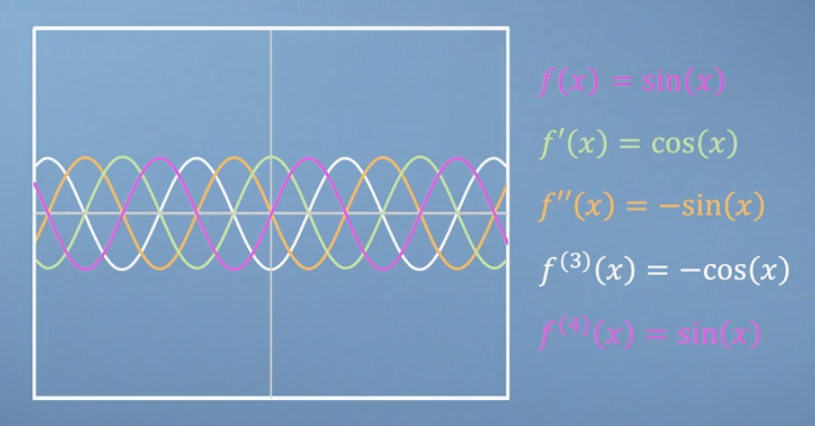
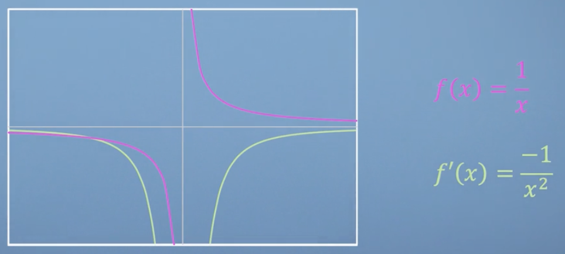
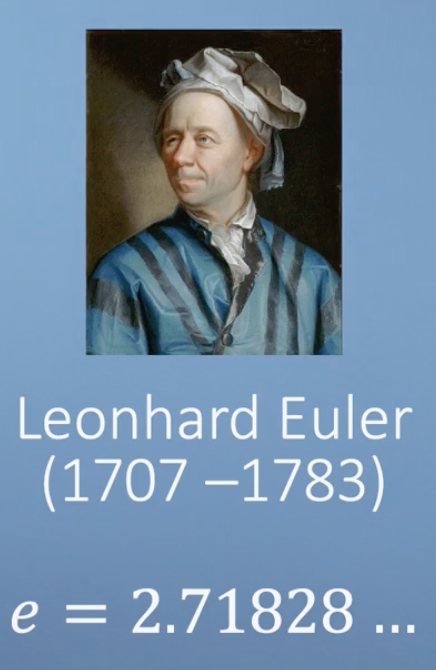
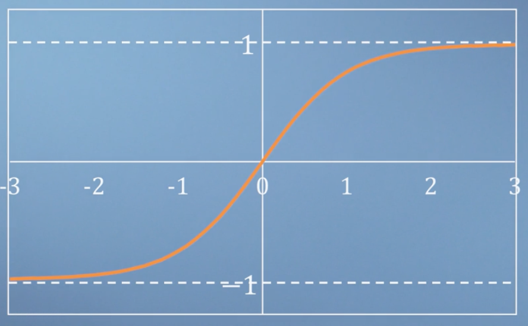
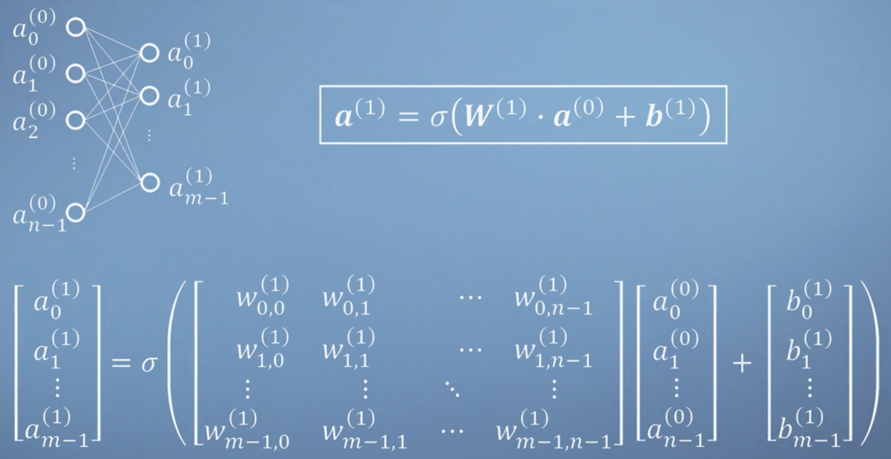
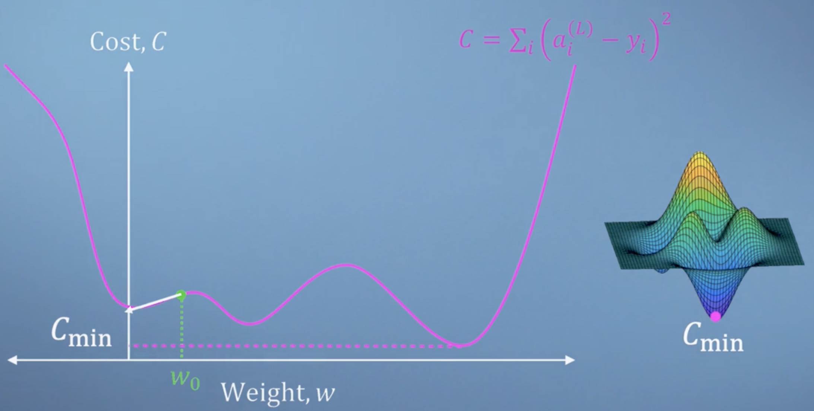
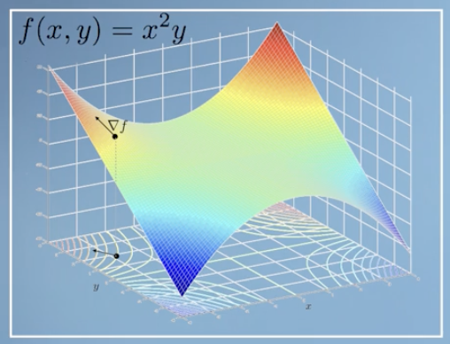

# Calculus


## Def of Derivative 導數 (slope)


### Deferentiation
$f'(x) = \lim_{dx \to 0} \frac{\frac{1}{x+dx} - \frac{1}{x}}{dx}$
$ = lim_{dx \to 0} \frac{\frac{x}{(x+dx)x} - \frac{(x+dx)}{(x+dx)x}}{dx}$
$ = lim_{dx \to 0} \frac{\frac{-dx}{(x+dx)x}}{dx}$
$ = lim_{dx \to 0} \frac{-1}{(x+dx)x}$
$ = lim_{dx \to 0} \frac{-1}{x^2}$




### Product rule
$if A(x) = f(x)g(x)$

Then $ A'(x) = f'(x)g(x) + f(x)g'(x)$

$u(x) = f(x)g(x)h(x)$ and $A(x) = f(x)g(x)$

Then $ u'(x) = A'(x)h(x) + A(x)h'(x) = f'(x)g(x)h(x) + f(x)g'(x)h(x) + f(x)g(x)h'(x)$

### Chain rule
The chain rule is used to differentiate composite functions. If h(x) = f(g(x)), then:

$h'(x) = f'(g(x)) * g'(x)$

$\frac{d}{dx} tan(x) = 1 + tan(x)^2$ 

since $\frac{d}{dx} tan(x) = \frac{d}{dx} \frac{sin(x)}{cos(x)}$
$= \frac{cos(x)cos(x) - sin(x)(-sin(x))}{cos(x)^2}$
$= \frac{cos(x)^2 + sin(x)^2}{cos(x)^2}$
$= \frac{1}{cos(x)^2} = sec(x)^2$

## Multivariate Calculus
### Differentiate
$f(x,y,z) = sin(x)e^{yz^2}$

$\frac{\partial f}{\partial x} = cos(x)e^{yz^2}$

$\frac{\partial f}{\partial y} = sin(x)z^2e^{yz^2}$

$\frac{\partial f}{\partial z} = sin(x)2yze^{yz^2}$

If $x = t-1, y = t^2, z = \frac{1}{t}$

Then $f(t) = sin(t-1)e^{t^2(\frac{1}{t})^2} = sin(t-1)e$

$f'(t) = \frac{\partial f}{\partial t} = cos(t-1)e$

Then $\frac{\partial f(x,y,z)}{\partial x} = \frac{\partial f}{\partial x}\frac{\partial x}{\partial t} + \frac{\partial f}{\partial y}\frac{\partial y}{\partial t} + \frac{\partial f}{\partial z}\frac{\partial z}{\partial t}$

$\frac{\partial f(x,y,z)}{\partial t} = cos(t-1)e$

### Jacobian Matrix
$f(x,y,z) = x^2y+3z$

$\frac{\partial f}{\partial x} = 2xy$

$\frac{\partial f}{\partial y} = x^2$

$\frac{\partial f}{\partial z} = 3$

$J =\begin{bmatrix} 2xy & x^2 & 3 \end{bmatrix}$

$J(0,0,0) = \begin{bmatrix} 0 & 0 & 3 \end{bmatrix}$

### The Sandpit

### The Hessian
The Hessian matrix is a square matrix of second-order partial derivatives of a scalar-valued function. It describes the local curvature of a function of many variables.

For a function $f(x,y)$, the Hessian matrix H is:

$H = \begin{bmatrix} \frac{\partial^2 f}{\partial x^2} & \frac{\partial^2 f}{\partial x \partial y} \\ \frac{\partial^2 f}{\partial y \partial x} & \frac{\partial^2 f}{\partial y^2} \end{bmatrix}$

If $f(x,y) = x^3 + y^3 - 3xy$

$J = \begin{bmatrix} 3x^2 - 3y & 3y^2 - 3x \end{bmatrix}$

$H = \begin{bmatrix} 6x & -3 \\ -3 & 6y \end{bmatrix}$

At a critical point $(x_0, y_0)$, the Hessian matrix can be used to determine the nature of the critical point:
*   If $det(H) > 0$ and $\frac{\partial^2 f}{\partial x^2} > 0$, then $(x_0, y_0)$ is a local minimum.
*   If $det(H) > 0$ and $\frac{\partial^2 f}{\partial x^2} < 0$, then $(x_0, y_0)$ is a local maximum.
*   If $det(H) < 0$, then $(x_0, y_0)$ is a saddle point.
*   If $det(H) = 0$, the test is inconclusive.

## Multivariate Chain rule
$f(x) = f(x_1,x_2,...x_n) = f(t)$

$\frac{\partial f}{\partial x} = \frac{\partial f}{\partial x_1} + \frac{\partial f}{\partial x_2} + ... + \frac{\partial f}{\partial x_n}$

$\frac{\partial x}{\partial t} = \frac{\partial x_1}{\partial t} + \frac{\partial x_2}{\partial t} + ... + \frac{\partial x_n}{\partial t}$

$\frac{\partial f(x,y,z)}{\partial t} = \frac{\partial f}{\partial x}\frac{\partial x}{\partial t}$

### Simple Neural networks
$\sigma(x)=tanh(x) = \frac{e^x - e^{-x}}{e^x + e^{-x}}$



$a^{(L)} = \sigma(W^{L} \cdot a^{(L-1)} + b^{L})$
#### Def
- $\sigma$ is the `activation function`(e.g., Sigmoid, ReLU, Tanh) which introduce linearity into the model, allowing it to learn more complex patterns
- $a$ is `activation` of the current layer
- $w$ This is the `weight` matrix for the current layer, L. These weights are the parameters that the network learns during training.
- $b$ This is the `bias` vector for the current layer, L. It's another learnable parameter that helps shift the activation function.

#### Example
```python
import numpy as np
# First set up the network.
sigma = np.tanh
W = np.array([[-2, 4, -1],[6, 0, -3]])
b = np.array([0.1, -2.5])

# Define our input vector
x = np.array([0.3, 0.4, 0.1])

# Calculate the values by hand,
# and replace a1_0 and a1_1 here (to 2 decimal places)
# (Or if you feel adventurous, find the values with code!)
z1 = W @ x + b
a1_0 = sigma(z1[0])
a1_1 = sigma(z1[1])
a1 = np.array([a1_0, a1_1])
```
### Cost Function


$\frac{\partial C}{\partial w} = \frac{\partial C}{\partial a} \frac{\partial a}{\partial z} \frac{\partial z}{\partial w}$

$\frac{\partial C}{\partial b} = \frac{\partial C}{\partial a} \frac{\partial a}{\partial z} \frac{\partial z}{\partial b}$

$Z^{(L)} = W^{(L)} \cdot a^{(L-1)} + b^{(L)}$

$a^{(L)} = \sigma(Z^{(L)})$

$C= \sum_i(a^{(L)}_i - y_i)^2$

#### Example
```python
# First we set the state of the network
σ = np.tanh
w1 = 1.3
b1 = -0.1

# Then we define the neuron activation.
def a1(a0) :
  z = w1 * a0 + b1
  return σ(z)

# Experiment with different values of x below.
x = 1, y = 0
a1(x)
c1 = (a1(x)-y)**2
c1
```
$\frac{\partial C}{\partial a} = 2 \cdot (a-y)$

$\frac{\partial a}{\partial z} = \sigma'(z) = \frac{\partial }{\partial z}tanh(z)) = 1 - tanh^2(z) = \frac{1}{cosh^2(z)}$

$\frac{\partial z}{\partial w} = a^{(L-1)}$

$\frac{\partial z}{\partial b} = 1$

## Taylor Series
The Taylor series is a representation of a function as an infinite sum of terms, calculated from the values of the function's derivatives at a single point.

$f(x) = \sum_{n=0}^{\infty} \frac{f^{(n)}(a)}{n!}(x-a)^n$

Where:
*   $f^{(n)}(a)$ is the nth derivative of the function f evaluated at point a.
*   $n!$ is the factorial of n.
*   $(x-a)^n$ is the nth power of (x-a).

### Taylor series formula
$g(x) = \sum_{n=0}^{\infty}\frac{1}{n!}f^{(n)}(a)(x-a)^n$

$= \frac{f^{(0)}(a)}{0!}(x-a)^0 + \frac{f^{(1)}(a)}{1!}(x-a)^1 + \frac{f^{(2)}(a)}{2!}(x-a)^2 + ...$
$= \sum_{n=0}^{\infty} \frac{f^{(n)}(a)}{n!}(x-a)^n$

如果一個函數 $f(x)$ 在某個點 $a$ 附近是無限可微的，那麼它的 **Taylor series** 是：

$$f(x) = f(a) + f'(a)(x - a) + \frac{f''(a)}{2!}(x - a)^2 + \frac{f^{(3)}(a)}{3!}(x - a)^3 + \cdots$$

或者更一般地寫成：

$$f(x) = \sum_{n=0}^{\infty} \frac{f^{(n)}(a)}{n!}(x - a)^n$$

* $f^{(n)}(a)$：表示第 n 階導數在點 $a$ 的值
* $(x - a)^n$：表示你在點 $a$ 附近的偏移
* $n!$：階乘，用來標準化每一階導數的貢獻

$e^x = 1 + x + \frac{x^2}{2!} + \frac{x^3}{3!} + ...$
$= \sum_{n=0}^{\infty}\frac{x^n}{n!}$


### Maclaurin series formula
當 **Taylor series 的展開點 $a = 0$**，就變成 **Maclaurin series**：

$$f(x) = f(0) + f'(0)x + \frac{f''(0)}{2!}x^2 + \frac{f^{(3)}(0)}{3!}x^3 + \cdots$$

或者：

$$f(x) = \sum_{n=0}^{\infty} \frac{f^{(n)}(0)}{n!}x^n$$

$\frac{f^{(0)}(0)}{0!}x^0 + \frac{f^{(1)}(0)}{1!}x^1 + \frac{f^{(2)}(0)}{2!}x^2 + ...$
$= \sum_{n=0}^{\infty} \frac{f^{(n)}(0)}{n!}x^n$

- 常見例子：

  | 函數           | Maclaurin 展開式                                      | 收斂範圍                |
  | ------------ | -------------------------------------------------- | ------------------- |
  | $e^x$        | $\sum_{n=0}^\infty \frac{x^n}{n!}$                 | $(-\infty, \infty)$ |
  | $\sin x$     | $\sum_{n=0}^\infty \frac{(-1)^n}{(2n+1)!}x^{2n+1}$ | $(-\infty, \infty)$ |
  | $\cos x$     | $\sum_{n=0}^\infty \frac{(-1)^n}{(2n)!}x^{2n}$     | $(-\infty, \infty)$ |
  | $\ln(1 + x)$ | $\sum_{n=1}^{\infty} \frac{(-1)^{n+1}}{n}x^n$      | $-1 < x \le 1$      |

- 實際用途：

  * 在 **數值分析** 中，拿一小段的多項式（稱為「泰勒多項式」）來近似原函數。
  * 在 **機器學習和深度學習** 中用來推導函數近似、激活函數導數等。
  * 在 **物理學** 中分析小擾動（如牛頓運動近似）。

#### 用 Maclaurin 級數來判斷 Maclaurin 級數是泰勒展開在 $x = 0$ 的特例：
$$f(x) = \sum_{n=0}^{\infty} \frac{f^{(n)}(0)}{n!}x^n$$

1. **Even function（偶函數）**： 圖像對稱於 $y$-軸 $$f(-x) = f(x)$$
   - 只有偶次方項 → 偶函數: $\cos x$ 的 Maclaurin 展開：
   $$\cos x = 1 - \frac{x^2}{2!} + \frac{x^4}{4!} - \cdots \quad \text{(只有偶數次方)}
\Rightarrow \text{even function}$$

2. **Odd function（奇函數）**：圖像對稱於原點 $$f(-x) = -f(x)$$
    - 只有奇次方項** → 奇函數: $\sin x$ 的 Maclaurin 展開：
   $$\sin x = x - \frac{x^3}{3!} + \frac{x^5}{5!} - \cdots \quad \text{(只有奇數次方)}
\Rightarrow \text{odd function}$$

3. **Neither（都不是）**：若以上兩者皆不成立
   - 偶次與奇次混合出現: $e^x$ 的展開：
  $$e^x = 1 + x + \frac{x^2}{2!} + \cdots \quad \text{(奇偶都有)}
\Rightarrow \text{neither}$$

| 函數        | Maclaurin 展開                        | 性質       |
| --------- | ----------------------------------- | -------- |
| $e^{x^2}$ | $1 + x^2 + \frac{x^4}{2!} + \cdots$ | ✅偶函數     |
| $\ln(x)$  | 沒有定義在 $x < 0$，所以 $f(-x)$ 不存在        | ❌neither |
| $\sin x$  | $x - \frac{x^3}{3!} + \cdots$       | ✅奇函數     |
| $\cos x$  | $1 - \frac{x^2}{2!} + \cdots$       | ✅偶函數     |
| $e^x$     | $1 + x + \frac{x^2}{2!} + \cdots$   | ❌neither |

- 判斷方式總結：

  > ✔ 用 Maclaurin 展開判斷奇偶性只要看「次方」就可以：

  * 只含 **偶次項** → 偶函數
  * 只含 **奇次項** → 奇函數
  * **兩種都有** → Neither

### Multivariate Taylor
The multivariate Taylor series for a function $f(\mathbf{x})$ around a point $\mathbf{a}$ is given by:

$$f(\mathbf{x}) = \sum_{|\alpha| \ge 0} \frac{1}{\alpha!} (\mathbf{x} - \mathbf{a})^\alpha \partial^\alpha f(\mathbf{a})$$

Where:
*   $\mathbf{x} = (x_1, x_2, \dots, x_n)$ is the vector of variables.
*   $\mathbf{a} = (a_1, a_2, \dots, a_n)$ is the expansion point.
*   $\alpha = (\alpha_1, \alpha_2, \dots, \alpha_n)$ is a multi-index, where $\alpha_i$ are non-negative integers.
*   $|\alpha| = \alpha_1 + \alpha_2 + \dots + \alpha_n$ is the order of the derivative.
*   $\alpha! = \alpha_1! \alpha_2! \dots \alpha_n!$.
*   $(\mathbf{x} - \mathbf{a})^\alpha = (x_1 - a_1)^{\alpha_1} (x_2 - a_2)^{\alpha_2} \dots (x_n - a_n)^{\alpha_n}$.
*   $\partial^\alpha f(\mathbf{a}) = \frac{\partial^{|\alpha|} f}{\partial x_1^{\alpha_1} \partial x_2^{\alpha_2} \dots \partial x_n^{\alpha_n}}(\mathbf{a})$ is the partial derivative of order $|\alpha|$ evaluated at $\mathbf{a}$.

For a function $f(x, y)$ expanded around $(a, b)$, the first few terms are:
$$f(x, y) \approx f(a, b) + \frac{\partial f}{\partial x}(a, b)(x-a) + \frac{\partial f}{\partial y}(a, b)(y-b) + \frac{1}{2!}\left(\frac{\partial^2 f}{\partial x^2}(a, b)(x-a)^2 + 2\frac{\partial^2 f}{\partial x \partial y}(a, b)(x-a)(y-b) + \frac{\partial^2 f}{\partial y^2}(a, b)(y-b)^2\right) + \dots$$

#### 2D Taylor series
The 2D Taylor series can also be written in a more compact form using matrix notation. Let $\mathbf{x} = \begin{pmatrix} x \\ y \end{pmatrix}$ and $\mathbf{a} = \begin{pmatrix} a \\ b \end{pmatrix}$.

Then, the Taylor series expansion up to the second order can be expressed as:

$$f(\mathbf{x}) \approx f(\mathbf{a}) + \nabla f(\mathbf{a})^T (\mathbf{x} - \mathbf{a}) + \frac{1}{2}(\mathbf{x} - \mathbf{a})^T H f(\mathbf{a}) (\mathbf{x} - \mathbf{a})$$

Where:
*   $\nabla f(\mathbf{a})$ is the gradient of $f$ evaluated at $\mathbf{a}$:
    $$\nabla f(\mathbf{a}) = \begin{pmatrix} \frac{\partial f}{\partial x}(a, b) \\ \frac{\partial f}{\partial y}(a, b) \end{pmatrix}$$
*   $H f(\mathbf{a})$ is the Hessian matrix of $f$ evaluated at $\mathbf{a}$:
    $$H f(\mathbf{a}) = \begin{pmatrix} \frac{\partial^2 f}{\partial x^2}(a, b) & \frac{\partial^2 f}{\partial x \partial y}(a, b) \\ \frac{\partial^2 f}{\partial y \partial x}(a, b) & \frac{\partial^2 f}{\partial y^2}(a, b) \end{pmatrix}$$

## Newton Raphson
牛頓-拉夫森法 (Newton-Raphson Method) 是一種在實數域上尋找函數根（即 $f(x) = 0$ 的解）的迭代方法。它利用函數在當前點的切線來估計下一個更接近根的點。

**基本思想：**

從一個初始猜測值 $x_0$ 開始，牛頓法通過以下迭代公式來產生一系列更接近根的近似值：

$$x_{n+1} = x_n - \frac{f(x_n)}{f'(x_n)}$$

其中：
*   $x_n$ 是當前迭代的近似值。
*   $f(x_n)$ 是函數在 $x_n$ 處的值。
*   $f'(x_n)$ 是函數在 $x_n$ 處的導數值。

**幾何解釋：**

在每一步迭代中，我們在點 $(x_n, f(x_n))$ 處繪製函數 $f(x)$ 的切線。這條切線的方程是：

$$y - f(x_n) = f'(x_n)(x - x_n)$$

牛頓法將這條切線與 $x$ 軸的交點作為下一個近似值 $x_{n+1}$。當 $y = 0$ 時，我們有：

$$0 - f(x_n) = f'(x_n)(x_{n+1} - x_n)$$
$$-f(x_n) = f'(x_n)(x_{n+1} - x_n)$$
$$\frac{-f(x_n)}{f'(x_n)} = x_{n+1} - x_n$$
$$x_{n+1} = x_n - \frac{f(x_n)}{f'(x_n)}$$

**收斂性：**

牛頓-拉夫森法通常具有二次收斂速度，這意味著在接近根時，每次迭代的有效數字會大約翻倍。然而，它對初始猜測值 $x_0$ 的選擇敏感，如果 $x_0$ 離根太遠，或者 $f'(x_n)$ 在某點接近零，方法可能不收

```python
def f (x) :
  return x**6/6 - 3*x**4 - 2*x**3/3 + 27*x**2/2 + 18*x - 30

def d_f (x) :
  return x**5 - 12*x**3 - 2*x**2 + 27*x + 18  # Complete this line with the derivative you have calculated.

x = -4 # starting point

d = {"x" : [x], "f(x)": [f(x)]}
for i in range(0, 20):
  x = x - f(x) / d_f(x)
  d["x"].append(x)
  d["f(x)"].append(f(x))

pd.DataFrame(d, columns=['x', 'f(x)'])
```
### Gradient Descent
梯度下降是一種常用的最佳化演算法，用於尋找函數的局部最小值。它透過迭代地沿著函數梯度（即函數增長最快的方向）的反方向移動來實現。

**基本思想：**

想像你身處山頂，目標是走到山谷最低點。如果你每次都沿著當前位置最陡峭的下坡方向走一小步，最終你就會到達山谷。梯度下降就是這個過程的數學類比。

對於一個函數 $f(\mathbf{x})$，其中 $\mathbf{x}$ 是一個向量，梯度下降的迭代更新公式為：

$$\mathbf{x}_{n+1} = \mathbf{x}_n - \eta \nabla f(\mathbf{x}_n)$$

其中：
*   $\mathbf{x}_n$ 是當前迭代的參數向量。
*   $\mathbf{x}_{n+1}$ 是下一次迭代的參數向量。
*   $\eta$ (eta) 是 **學習率 (learning rate)**，它決定了每一步移動的步長大小。學習率過大可能導致跳過最小值，學習率過小則會導致收斂速度過慢。
*   $\nabla f(\mathbf{x}_n)$ 是函數 $f$ 在 $\mathbf{x}_n$ 處的梯度。梯度是一個向量，其方向指向函數增長最快的方向，因此其反方向 $-\nabla f(\mathbf{x}_n)$ 指向函數下降最快的方向。

**梯度 (Gradient)：**

對於一個多變量函數 $f(x_1, x_2, \dots, x_n)$，其梯度 $\nabla f$ 是一個包含所有偏導數的向量：

$$\nabla f = \begin{pmatrix} \frac{\partial f}{\partial x_1} \\ \frac{\partial f}{\partial x_2} \\ \vdots \\ \frac{\partial f}{\partial x_n} \end{pmatrix}$$

梯度的方向是函數值增加最快的方向，而梯度的模長表示函數值增加的速度。

- Example

  if $f(x,y) = x^2y,$
  

  then $\nabla f=\begin{bmatrix} \frac{\partial{f}}{\partial{x}} & \frac{\partial{f}}{\partial{y}} \end{bmatrix} = \begin{bmatrix} 2xy & x^2 \end{bmatrix}$

**應用：**

梯度下降廣泛應用於機器學習和深度學習中，用於訓練模型，例如：
*   **線性迴歸 (Linear Regression)**：最小化均方誤差 (Mean Squared Error)。
*   **邏輯迴歸 (Logistic Regression)**：最小化交叉熵損失 (Cross-Entropy Loss)。

### Constrained Optimisation
約束優化 (Constrained Optimization) 是指在滿足一組特定條件（約束條件）的情況下，尋找函數的最大值或最小值。這在現實世界中非常常見，例如：

*   在資源有限的情況下最大化生產利潤。
*   在滿足安全標準的情況下最小化工程成本。
*   在機器學習中，為了防止過擬合而對模型參數進行約束（如 L1/L2 正則化）。

### 數學形式

一個典型的約束優化問題可以表示為：

最小化 (或最大化) $f(\mathbf{x})$
受限於 (subject to):
$g_i(\mathbf{x}) \le 0$, for $i = 1, \dots, m$ (不等式約束)
$h_j(\mathbf{x}) = 0$, for $j = 1, \dots, p$ (等式約束)

其中：
*   $f(\mathbf{x})$ 是目標函數 (objective function)，$\mathbf{x}$ 是優化變量。
*   $g_i(\mathbf{x})$ 是不等式約束函數。
*   $h_j(\mathbf{x})$ 是等式約束函數。

### 解決方法

解決約束優化問題的方法有很多，其中最常用的是：

1.  **拉格朗日乘數法 (Lagrange Multipliers)**：
    主要用於解決**等式約束**下的優化問題。其核心思想是將約束條件融入目標函數，構造一個新的函數（拉格朗日函數），然後對其求導並令其為零，以找到極值點。

    對於一個目標函數 $f(x, y)$ 和一個等式約束 $g(x, y) = 0$，拉格朗日函數 $L(x, y, \lambda)$ 定義為：
    $$L(x, y, \lambda) = f(x, y) - \lambda g(x, y)$$
    其中 $\lambda$ 是拉格朗日乘數。然後，我們求解以下方程組：
    $$\frac{\partial L}{\partial x} = 0$$
    $$\frac{\partial L}{\partial y} = 0$$
    $$\frac{\partial L}{\partial \lambda} = 0 $$


#### Example    
Maximize f(x, y) = xy subject to x + y = 10
    # L(x, y, lambda) = xy - lambda(x + y - 10)

    # Partial derivatives:
    # dL/dx = y - lambda = 0  => y = lambda
    # dL/dy = x - lambda = 0  => x = lambda
    # dL/d(lambda) = -(x + y - 10) = 0 => x + y = 10

    # From the first two equations, x = y = lambda.
    # Substitute into the third equation: lambda + lambda = 10 => 2*lambda = 10 => lambda = 5
    # So, x = 5, y = 5.
    # The maximum value of f(x,y) = xy is 5 * 5 = 25.

- 定義（指數函數組成）

$$\sinh(y) = \frac{e^y - e^{-y}}{2} \quad\text{（雙曲正弦）}$$

$$\cosh(y) = \frac{e^y + e^{-y}}{2} \quad\text{（雙曲餘弦）}$$

$$\tanh(y) = \frac{\sinh(y)}{\cosh(y)} = \frac{e^y - e^{-y}}{e^y + e^{-y}} \quad\text{（雙曲正切）}$$

- 基本性質

  | 函數         | 奇偶性                         | 常用值            |
  | ---------- | --------------------------- | -------------- |
  | $\sinh(y)$ | 奇函數：$\sinh(-y) = -\sinh(y)$ | $\sinh(0) = 0$ |
  | $\cosh(y)$ | 偶函數：$\cosh(-y) = \cosh(y)$  | $\cosh(0) = 1$ |
  | $\tanh(y)$ | 奇函數                         | $\tanh(0) = 0$ |


- 關鍵恆等式

* **類似三角函數的畢氏恆等式**：

$$\cosh^2(y) - \sinh^2(y) = 1$$

對比三角函數的 $\cos^2\theta + \sin^2\theta = 1$

* **倒數關係**：

$$\text{sech}(y) = \frac{1}{\cosh(y)}, \quad
\text{csch}(y) = \frac{1}{\sinh(y)}, \quad
\coth(y) = \frac{\cosh(y)}{\sinh(y)}$$

- 導數

$$\frac{d}{dy} \sinh(y) = \cosh(y)$$

$$\frac{d}{dy} \cosh(y) = \sinh(y)$$

$$\frac{d}{dy} \tanh(y) = \text{sech}^2(y)$$

- 圖形特徵（文字描述）

* $\sinh(y)$：過原點，單調遞增，類似指數曲線，但對稱於原點。
* $\cosh(y)$：U 形曲線，最小值在 $y=0$，值為 1，隨 $|y|$ 增加指數增長。
* $\tanh(y)$：S 形曲線，漸近線為 $y \to \pm\infty$ 時 $\tanh(y) \to \pm 1$。

- 幾何與應用

* $\cosh(y)$ 的圖形是**懸鏈線（catenary）**，描述吊在兩點間的繩索形狀。
* 雙曲函數常出現在：

  * 相對論的速度疊加
  * 某些積分解
  * 偏微分方程（特別是波動方程和熱方程）的解
  * 工程學中的懸鏈曲線、拋物線近似

```python
# Import libraries
import numpy as np
from scipy import optimize

# First we define the functions, YOU SHOULD IMPLEMENT THESE
def f (x, y) :
    return -np.exp(x-y**2+x*y)

def g (x, y) :
    return np.cosh(y)+x-2

# Next their derivatives, YOU SHOULD IMPLEMENT THESE
def dfdx (x, y) :
    return (y+1)* (-np.exp(x-y**2+x*y))

def dfdy (x, y) :
    return (-2*y+x)*(-np.exp(x-y**2+x*y))

def dgdx (x, y) :
    return 1

def dgdy (x, y) :
    return np.sinh(y)

# Use the definition of DL from previously.
def DL (xyλ) :
    [x, y, λ] = xyλ
    return np.array([
            dfdx(x, y) - λ * dgdx(x, y),
            dfdy(x, y) - λ * dgdy(x, y),
            - g(x, y)
        ])

# To score on this question, the code above should set
# the variables x, y, λ, to the values which solve the
# Langrange multiplier problem.

# I.e. use the optimize.root method, as you did previously.
(x0, y0, λ0) = (1, 0, 0)
x, y, λ = optimize.root(DL, [x0, y0, λ0]).x

print("x = %g" % x)
print("y = %g" % y)
print("λ = %g" % λ)
print("f(x, y) = %g" % f(x, y))
```

## Regression
### Simple linear regression
$y = y(x_i;a_i)=mx_i+c, a = \begin{bmatrix} m \\ c \end{bmatrix}, r_i = y_i-mx_i-c$

$x^2 = \sum_{i=1}r_i^2=\sum_{i=1}(y_i-mx_i-c)^2$

$\nabla x^2 = \begin{bmatrix} \frac{\partial x^2}{\partial m} & \frac{\partial x^2}{\partial c} \end{bmatrix} = \begin{bmatrix} -2\sum_{i=1}(y_i-mx_i-c)x_i \\ -2\sum_{i=1}(y_i-mx_i-c) \end{bmatrix}$

$m = \frac{\sum(x_i-\bar{x})y_i}{\sum(x_i-\bar{x})^2}, c = \bar{y}-m\bar{x}$

```python
# Here the function is defined
def linfit(xdat,ydat):
  # Here xbar and ybar are calculated
  xbar = np.sum(xdat)/len(xdat)
  ybar = np.sum(ydat)/len(ydat)

  # Insert calculation of m and c below
  m = np.sum((xdat-xbar)*ydat)/np.sum((xdat-xbar)**2)
  c = ybar-m*xbar
  # Return your values as [m, c]
  return [m, c]
```
```python
from scipy import stats

# Use the stats.linregress() method to evaluate regression
regression = stats.linregress(xdat,ydat)
```

#### General non linear least squares
$f(x;\sigma;x_p;I;b) = b+ \frac{I}{\sigma{\sqrt{2\pi}}}e^{\frac{-(x-x_p)^2}{(2\sigma^2)}}$

$J = \begin{bmatrix} \frac{\partial(x^2)}{\partial \sigma} , \frac{\partial(x^2)}{\partial x_p} , \frac{\partial(x^2)}{\partial I} , \frac{\partial(x^2)}{\partial b} \end{bmatrix}$


---

*   **Power Rule:** $d/dx(x^n) = nx^(n-1)$
*   **Constant Multiple Rule:** $d/dx(c*f(x)) = c*d/dx(f(x))$
*   **Sum Rule:** $d/dx(f(x) + g(x)) = d/dx(f(x)) + d/dx(g(x))$
*   **Difference Rule:** $d/dx(f(x) - g(x)) = d/dx(f(x)) - d/dx(g(x))$
*   **Product Rule:** $d/dx(f(x)g(x)) = f(x)d/dx(g(x)) + g(x)d/dx(f(x))$
*   **Quotient Rule:** $d/dx(f(x)/g(x)) = (g(x)d/dx(f(x)) - f(x)d/dx(g(x))) / (g(x))^2$

### Chain Rule

The chain rule is used to differentiate composite functions. If h(x) = f(g(x)), then:

h'(x) = f'(g(x)) * g'(x)

### Partial Derivatives

For a function with multiple variables, the partial derivative is the derivative with respect to one of those variables, with the others held constant.

For a function f(x, y), the partial derivative with respect to x is denoted as ∂f/∂x, and the partial derivative with respect to y is denoted as ∂f/∂y.

### Gradient

The gradient of a scalar-valued function f(x, y, z) is a vector of its partial derivatives:

∇f = (∂f/∂x, ∂f/∂y, ∂f/∂z)

### Hessian Matrix

The Hessian matrix is a square matrix of second-order partial derivatives of a scalar-valued function. It describes the local curvature of a function of many variables.

H = [[∂²f/∂x², ∂²f/∂x∂y], [∂²f/∂y∂x, ∂²f/∂y²]]

### Jacobian Matrix

The Jacobian matrix is the matrix of all first-order partial derivatives of a vector-valued function. It represents the best linear approximation of the function near a given point.

J = [[∂y₁/∂x₁, ..., ∂y₁/∂xₙ], [..., ..., ...], [∂yₘ/∂x₁, ..., ∂yₘ/∂xₙ]]